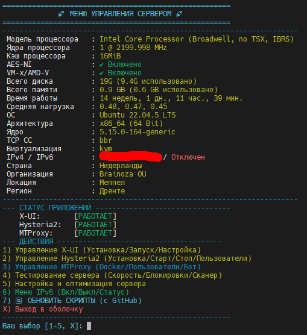

# 🚀 Server Management Menu

Удобный набор скриптов для управления сервером Ubuntu. Позволяет в один клик настраивать BBR, фаервол, управлять IPv6, а также устанавливать и настраивать X-UI и Hysteria2.



## ✨ Возможности
- **Оптимизация**: Включение/выключение BBR, управление PING (ICMP).
- **Безопасность**: Удобный интерфейс для UFW (открытие/закрытие портов).
- **Прокси**: Быстрая установка и управление 3x-ui и Hysteria 2.
- **Сеть**: Полное управление IPv6 (включение/отключение на уровне ядра).
- **Тесты**: Speedtest, iPerf3, RealityTLS Scanner (с автозагрузкой GeoIP).

## 🚀 Быстрая установка / Обновление

Для установки всех инструментов или обновления текущей версии до актуальной (с GitHub), выполните команду:

```bash
bash <(curl -sL [https://raw.githubusercontent.com/ТВОЙ_ЛОГИН/ИМЯ_РЕПО/main/install.sh](https://raw.githubusercontent.com/Diman6267/VPS-Server-Menu/main/install.sh))
